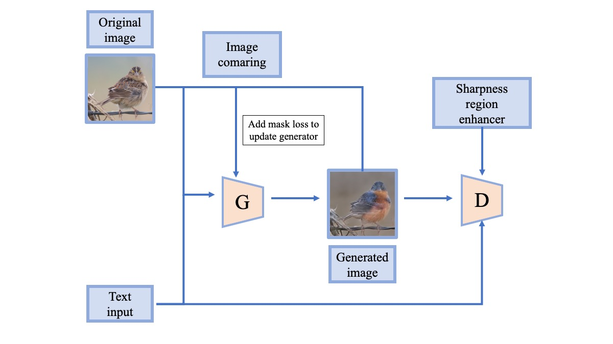

# Text-guided Image Manipulation with Image Comparing \& Sharp Region Enhancing
This repository contains the codes and models for the the course project of [Deep Learning](http://www.da.inf.ethz.ch/teaching/2021/DeepLearning) (Fall 2021). Our [project](https://github.com/fransiskusyoga/Lightweight-Manipulation) is based on the paper ["Lightweight Generative Adversarial Networks for Text-Guided Image Manipulation"](https://proceedings.neurips.cc/paper/2020/file/fae0b27c451c728867a567e8c1bb4e53-Paper.pdf) [[1]](#1). Our project report can be found [here](DL_report.pdf).

### Overview


Two main focuses in text-based image editing GAN is how we preserve regions in the image that are not related to the text description and generating higher quality images. In our project we introduce two new methods: Image Comparing and Sharp Region Enhancing (SRE) to improve the quality of text-guided image generation. In this repository the two methods are integrated into the Lightweight Generative Adversarial Networks [Lightweight-Manipulation](https://github.com/mrlibw/Lightweight-Manipulation) and tested on CUB [bird](https://drive.google.com/file/d/1R01J63Vqzg5463ycIyK_MHI4jXMFCihx/view).

### Useage
Get our repository and the required dependencies:
```
git clone https://github.com/fransiskusyoga/Lightweight-Manipulation.git
pip3 install -r requirements.txt
```

### Data

1. Download the preprocessed metadata for [bird](https://drive.google.com/file/d/1R01J63Vqzg5463ycIyK_MHI4jXMFCihx/view) and save it into `data/`.
2. Download [bird](http://www.vision.caltech.edu/visipedia/CUB-200-2011.html) dataset and extract the images to `data/birds/`

### Training
Training can be conducted on [Euler](https://scicomp.ethz.ch/wiki/Euler).

#### [DAMSM](https://github.com/taoxugit/AttnGAN) model includes a text encoder and an image encoder
- Pre-train DAMSM model for bird dataset:
```
python pretrain_DAMSM.py --cfg cfg/DAMSM/bird.yml --gpu 0
```

#### Our Model
- Train the model for bird dataset:
```
python main.py --cfg cfg/train_bird.yml --gpu 0
```
- To train the model with histogram maching step for bird dataset change MASK_HIST to `True` in `train_bird.yml`.

`*.yml` files include configuration for training and testing. To reduce the number of parameters used in the model, please edit DF_DIM and/or GF_DIM values in the corresponding `*.yml` files.

#### Pretrained DAMSM Model
- [DAMSM for bird](https://drive.google.com/file/d/1n-qKR7K4V-4oVC1GaGeIHLTQfIzPsTsE/view?usp=sharing). Download and save it to `DAMSMencoders/`.

### Testing
- Test our model on bird dataset:
```
python main.py --cfg cfg/eval_bird.yml --gpu 0
```
### Evaluation

- To generate images for all captions in the testing dataset, change B_VALIDATION to `True` in the `eval_bird.yml`. 
- [Fréchet Inception Distance](https://github.com/mseitzer/pytorch-fid).
- [Inception Score](https://github.com/fransiskusyoga/Lightweight-Manipulation/blob/develop/code/check_inception_score.py).

### Code Structure
- code/main.py: the entry point for training and testing.
- code/trainer.py: creates the networks, harnesses and reports the progress of training.
- code/model.py: defines the architecture.
- code/mask_fcn: compute the mask with pre-trained model approach.
- code/mask_torch: compute the mask with histogram matching approach.
- code/attention.py: defines the spatial and channel-wise attentions.
- code/VGGFeatureLoss.py: defines the architecture of the VGG-16.
- code/datasets.py: defines the class for loading images and captions.
- code/pretrain_DAMSM.py: trains the text and image encoders, harnesses and reports the progress of training. 
- code/compute_fid.py: computes the FID score between generated images and original images.
- code/miscc/losses.py: defines and computes the losses.
- code/miscc/config.py: creates the option list.
- code/miscc/utils.py: additional functions.

## Authors
- Yoga Fransiskus (ywibowo@student.ethz.ch)
- Zhi Ye (yezh@student.ethz.ch)
- Takumi Takada (ttakada@student.ethz.ch)
- Adnana Tudose (atudose@student.ethz.ch)

### Acknowledgements
This code borrows heavily from Lightweight Generative Adversarial Networks ([Lightweight-Manipulation](https://github.com/mrlibw/Lightweight-Manipulation)) repositories. We really appreciate their outstanding work.

## References
<a id="1">[1]</a> [Li, Bowen and Qi, Xiaojuan and Torr, Philip and Lukasiewicz, Thomas. "Lightweight Generative Adversarial Networks for Text-Guided Image Manipulation". 2020.](https://proceedings.neurips.cc/paper/2020/file/fae0b27c451c728867a567e8c1bb4e53-Paper.pdf)
